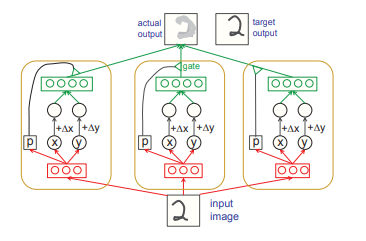
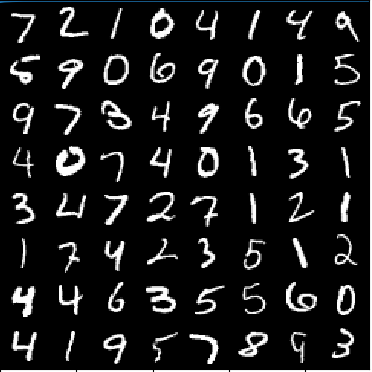
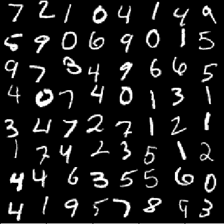
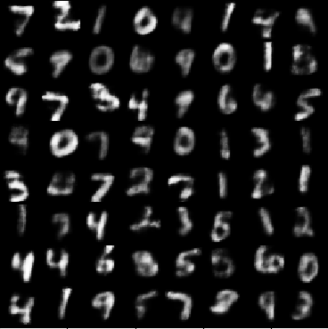

# Transforming Auto-encoders
An open source *fast and dirty* implementation of the paper by Hinton et.al in PyTorch

	[Hinton, Geoffrey E., Alex Krizhevsky, and Sida D. Wang. "Transforming auto-encoders." International Conference on Artificial Neural Networks. Springer, Berlin, Heidelberg, 2011.](http://www.cs.toronto.edu/~fritz/absps/transauto6.pdf)


The authors have used a simple **capsule-based** network to model and estimate the instantiation paraments of an image implicitly. Each capsule outputs the probability of a feature being present in it as well as its instantiation paraments. These can include but are not limited to its pose, relative position of feature in image, lighthing and deformations.

The generated output of the capsule has an element wise multiplication operation done with the probability output. This ensures that the featues the capsule is confident about come through while the ones it isn't confident about aren't.



The goal with this aporoach is to overcome the activation invariance of the pooling CNNs towards change in pose. In capsule based networks the probability termis invariant but the learnt instantiation paraments are *equivariant* i.e as the feature moves over the viewing windows the parameters change accordingly.

## Implementational Details:
The auto encoder was trained on the MNIST data set with the following parameters:

1. Number of capsules : 50 
2. Number of recogizer units : 10
3. Number of generator units : 50
4. Loss function : Binary cross-entropy loss
5. Optimizer : Adam (lr = 0.001)

## Usage
### Requirements

* python3
* PyTorch
* TorchVision
* OpenCV
* Numpy

	 requires the following directories to exist:
``` 
	images/
		input
		output
		Target
		misc
```
run main.py 
+ every 100th input, output, and target is stored in corresponding folder in the images directory.
+ Every 500th images learnt instantiation parameters are stored in [data/](/data/instantiate.txt)

## Similar projects
- [yingzha/Transforming-Autoencoders](https://github.com/yingzha/Transforming-Autoencoders): Theano impemetation
- [nikhil-dce/Transforming-Autoencoder-TF](https://github.com/nikhil-dce/Transforming-Autoencoder-TF)
- [ndrplz/transforming-autoencoders](https://github.com/ndrplz/transforming-autoencoders)
- [ethanscho/TransformingAutoencoders](https://github.com/ethanscho/TransformingAutoencoders)
- [HedgehogCode/transforming-autoencoders-tf](https://github.com/HedgehogCode/transforming-autoencoders-tf)

## Results

### 1. Translation

**Input**  

**Target**  

**output**  



```
instantiation parameters:
 0.9520  0.8384  
 1.0781  0.2667  
 0.8075  0.6620  
 1.0397  0.6349  
 1.0205  0.7614  
 0.8079  0.7330  
 1.0740  0.4923  
 1.2304  0.9519  
 0.7654  0.3737  
 1.0896  0.9264  
 0.8968  0.3737  
 1.0632  0.4914  
 1.2427  0.8692  
 1.0610  0.7803  
 0.9159  0.6398  
 1.0705  0.5221  
 1.1337  0.8847  
 0.8312  0.7785  
 0.9586  0.5158  
 1.2502  0.7020  
 1.0838  0.9017  
 1.2064  0.3760  
 1.0107  0.5047  
 1.0682  0.6339  
 1.1638  0.7343  
 0.7300  0.2766  
 0.8662  0.6798  
 1.2302  0.8111  
 1.0901  0.5846  
 1.0109  0.6038  
 0.9310  0.7815  
 1.0272  0.6646  
 0.9818  0.7216  
 1.0485  0.3382  
 0.9677  0.8186  
 0.7882  0.3322  
 0.8297  0.6006  
 0.9788  0.7402  
 0.9239  0.4723  
 0.8208  0.6940  
 0.8456  0.6394  
 1.0345  0.8674  
 1.2721  0.7310  
 0.8291  0.6967  
 0.9926  0.4464  
 0.9995  0.7093  
 1.0880  0.6422  
 1.0645  0.4427  
 1.2237  0.9537  
 0.9561  0.7259  
 0.9797  0.3822  
 0.9628  0.5443  
 0.9664  0.7922  
 0.9768  0.6690  
 1.0443  0.3551  
 1.1169  0.8140  
 1.0471  0.5615  
 0.7883  0.7229  
 1.0446  1.0281  
 0.9290  0.6205  
 0.9081  0.7887  
 1.0705  0.4685  
 1.2733  0.6270  
 0.9609  0.5863  
```
## TODOs:
1. Add support for learning affine transformations.
2. Add support for the NORB dataset.

